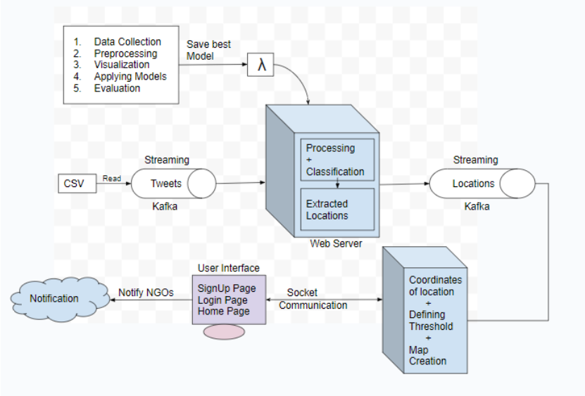

# Real-Time Earthquake Detection and Analysis Using Twitter Data
A course project on Information Retrieval course (CSE508)

## Overview
This project aims to develop a real-time earthquake detection and notification system by analyzing Twitter data using deep learning algorithms. The goal is to provide a cost-effective, timely solution that can quickly and accurately detect seismic events and alert NGOs and monitoring committees, potentially saving lives and mitigating the impact of earthquakes.

### Methodology
1. **Tweet Extraction:** Use Kafka Streaming to process historic tweet data in real-time.
2. **BERT Classification:** Classify tweets as relevant or irrelevant regarding earthquakes.
3. **Kafka Streaming:** Stream tweets and process them for real-time analysis.
4. **Bing API:** Find coordinates of the extracted locations.
5. **Flask:** Build the web application for real-time updates.
6. **Folium:** Create maps using location coordinates.
7. **Socket:** Facilitate communication between front-end and back-end.
8. **React JS:** Provide a user-friendly interface for notifications.

### Architecture


## Installation and Setup

#### 1. **Run Classification Model**
   - Load the training and test datasets in Google Colab.
   - Execute the `ir_bert_model.py` file located in the `Final Deliverables` folder.

#### 2. **Install Docker and Docker Compose**

#### 3. **Copy and Save the Model**
   ```bash
   mkdir -p /[your_project_path]/IR_Project_BE/model/
   cp [your_saved_model_path] /[your_project_path]/IR_Project_BE/model/
  ```

#### 4. **For Setting up Kafka and Zookeeper**
  ```bash
cd /[your_project_path]/kafka-docker/
docker compose up -d
  ```

#### 5. **For running Kafka Producer  nodejs service for real time tweets streaming**
  ```bash
cd /[your_project_path]/kafka-producer/
docker build . --no-cache -t producer-api
docker run -it --init --net="host" -d --name producer-api-ins producer-api
  ```

#### 6. **For running prediction flask webserver**
  ```bash
cd /[your_project_path]/IR_Project_BE/
docker build . --no-cache -t predict-api
docker run -it --init --net="host" -d --name predict-api-ins predict-api
  ```

#### 7. **For running map creator flask webserver**
  ```bash
cd /[your_project_path]/MapCreator/
docker build . --no-cache -t map-api
docker run -it --init --net="host" -d --name map-api-ins map-api
  ```

#### 8. **For running UI of the application**
  ```bash
cd /[your_project_path]/FrontEndWithFireBase/
docker build . --no-cache -t frontend
docker run -it --init --net="host" -d --name frontend-ins frontend
  ```

## Guide

- [Rajiv Ratn Shah](https://midas.iiitd.edu.in/team/rajiv-ratn-shah.html)


## Contributors

- Sumit Bhagat
- Anurag Gautam
- Saloni Srivastav
- Saloni Garg
- Surbhi Goyal
- Muskaan Gupta


